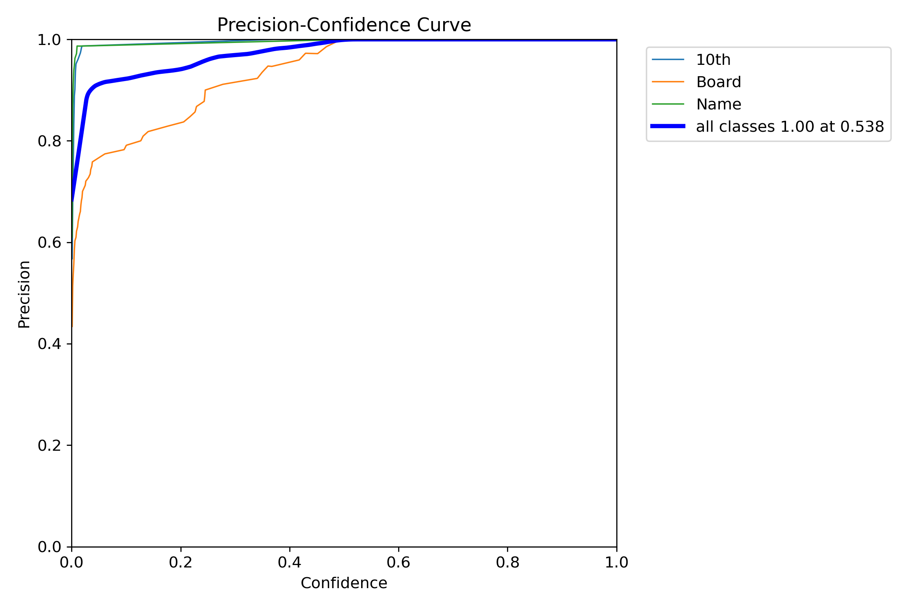
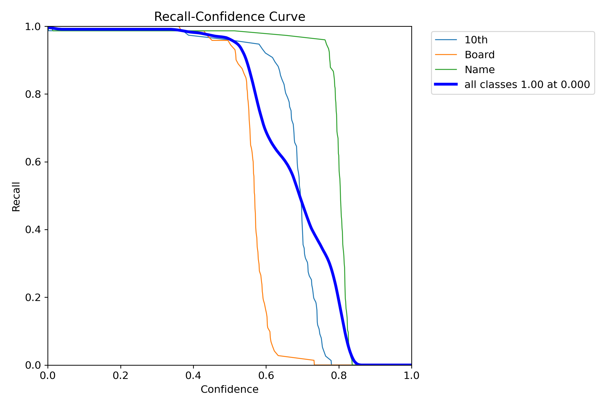
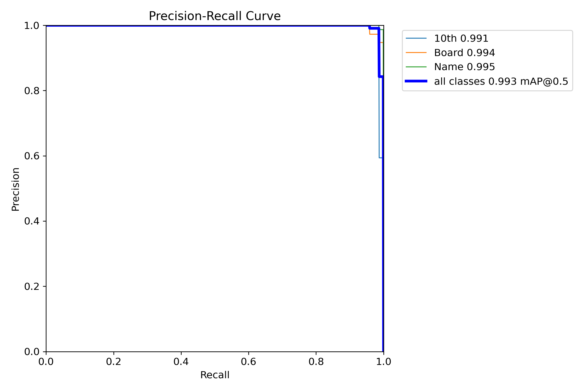
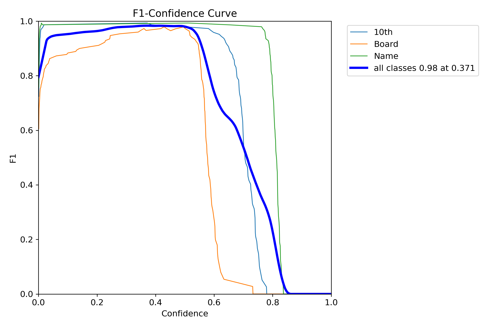
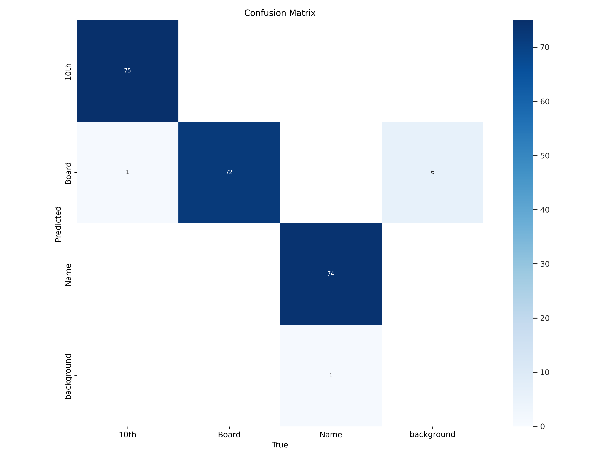
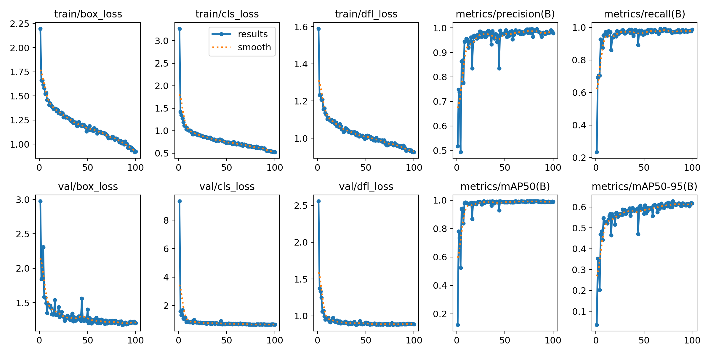

# AUTOMATED STUDENTS EXTRACTION FROM DOCUMENTS UDING YOLOv8 AND TESSERACT OCR
This project focuses on automating the extraction of details such as Name, Board of Education, and more from scanned documents. By leveraging Tesseract OCR, an Optical Character Recognition (OCR) tool, and implementing various computer vision techniques, we have developed an effective solution for this task.

## About
In the evolving digital landscape, this project pioneers a transformative leap in text recognition. By integrating YOLOv8 and Tesseract, it efficiently bridges the divide between printed content and digital data utilization. With a focus on streamlining academic record extraction, the project's core objective is to cultivate a robust system, seamlessly identifying and processing crucial information. By automating document verification, it minimizes human error, elevating operational efficiency and marking a significant advancement in the domain of document validation.

## Features
1. **Cutting-edge Integration**: Harnesses the power of YOLOv8 and Tesseract for state-of-the-art object detection and optical character recognition.
2. **Seamless Automation**: Effortlessly identifies and processes crucial information from documents, ensuring accuracy and operational efficiency.
3. **Mitigation of Human Error**: Automates document verification to reduce the potential for human error in data extraction.
4. **Transparency and Efficiency**: Represents a forward-thinking approach to document validation, enhancing operational efficiency and instilling transparency in administrative processes.

## Project Flow

## User Flow Diagram

# Training Model 

## YOLOv8 Object Detection Model Training
Welcome to the training model page of our project. In this document, we'll provide you with an overview of the YOLOv8 object detection model, explain the dataset, and guide you through the training process.

## YOLOv8 Overview
YOLOv8 (You Only Look Once version 8) is a state-of-the-art object detection algorithm. It provides real-time and accurate object detection by dividing an image into a grid and making predictions for objects within each grid cell. YOLOv8 is a versatile framework, and in this project, we've trained a custom YOLOv8 model for the specific task of detecting "Name", "Board of Education" and "STANDARD" within marksheets.

## Dataset
Our dataset consists of nearly 500+ images, with "Name", "Board of Education" and "STANDARD" annotated in YOLOv8 format. The dataset has been pre-processed and augmented to enhance the diversity and quality of the training data. Augmentation techniques include horizontal and vertical flips, rotations, random cropping, brightness adjustments, exposure adjustments, Gaussian blur, and noise.

## Training Process

To train our custom YOLOv8 model, we used the processed dataset and a specific model configuration. Training involved optimizing the model's parameters to accurately detect "Name", "Board of Education" and "STANDARD" within marksheets. We performed training for a specified number of epochs and evaluated the model's performance on validation data.

## Model Configuration

Our YOLOv8 model is configured with specific hyperparameters, architecture details, and object detection settings. The model configuration file and weights are available in this repository.

## Results and Evaluation

After training the model, we conducted an evaluation to assess its performance. We used various metrics to measure the accuracy, precision, recall, and F1-score of our object detection model.

## License
This project is licensed under the <a href="./LICENSE">MIT License</a>.
